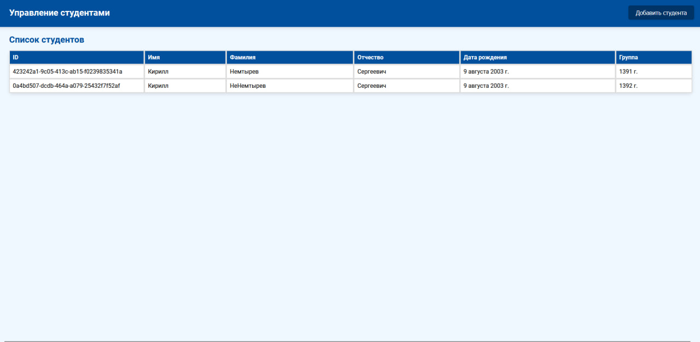
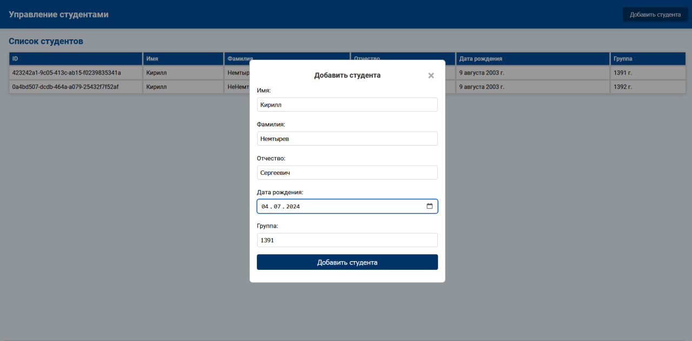

### Описание
Разработано приложение, которое включает в себя серверную часть на Java и клиентскую на JavaScript. Приложение позволяет выполнять CRUD операции с данными о студентах через REST API.

### Состав приложения:

- База данных:
  Используется PostgreSQL, запускаемый через Docker Compose.
- Серверная часть:
  Фильтр CORS: Класс CorsConfig обрабатывает запросы для разрешения междоменных запросов.
  Управление базой данных: Класс DatabaseConfig предоставляет методы для работы с базой данных через SQL-запросы.
  Сервис управления студентами: Класс StudentService предоставляет методы для создания, удаления и получения данных о студентах.
  Обработка моделей данных: Классы StudentDao используются для передачи данных.
- Клиентская часть:
  Разработан интерфейс на HTML и JavaScript, позволяющий добавлять, удалять и просматривать список студентов.

### Инструкция по запуску:
1. Установите и запустите Docker
2. Настройте базу данных, запустите файл docker-compose.yml с конфигурацией PostgreSQL и запустите контейнер.
3. Установите Tomcat - скачайте Apache Tomcat и разархивируйте его.
4. Откройте проект в IntelliJ IDEA или другом IDE, и соберите .war файл.
```
./gradlew war
```
5. Настройте и запустите Tomcat, в IntelliJ IDEA перейдите в Run -> Edit Configurations. Добавьте новую конфигурацию Tomcat Server Local.В поле Application server укажите путь до директории Tomcat. В Deployment добавьте созданный .war файл (+ -> External Source), затем нажмите Apply. Запустите сервер Tomcat.
6. Запустите Docker и Tomcat Убедитесь, что Docker контейнер с PostgreSQL запущен. В IntelliJ IDEA или другом IDE запустите сервер Tomcat.
7. Откройте resources/front/index.html. Воспользуйтесь веб-интерфейсом для работы со студентами.

### Видео
[Ссылка на гугл диск](https://drive.google.com/file/d/117vEzjpCTW-rXSFbdTFNiGRh7NQkKDpG/view?usp=sharing)

### Итоговый вид проекта


