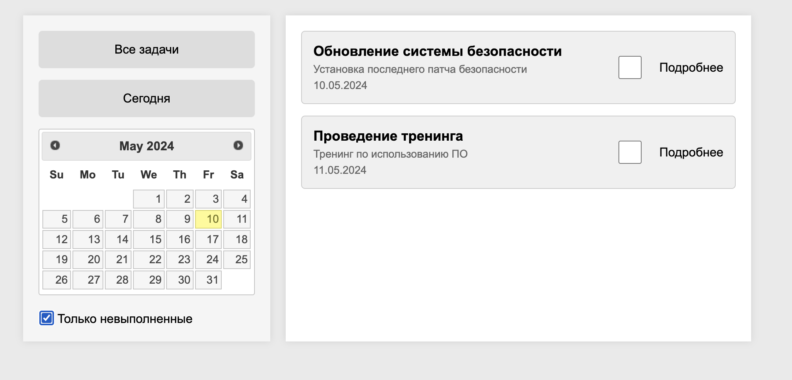
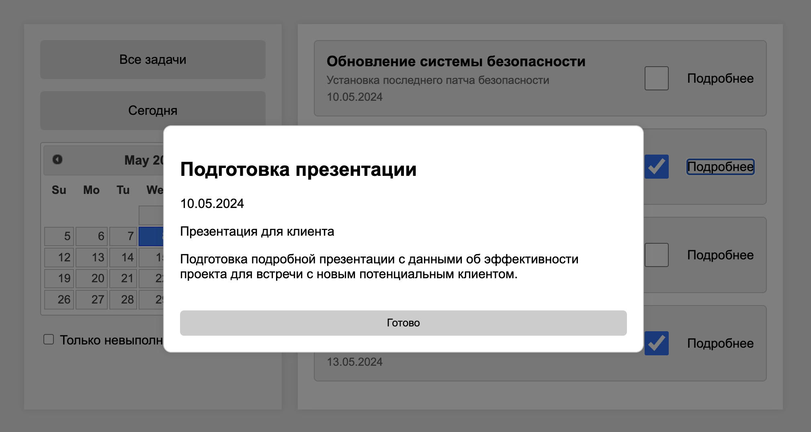
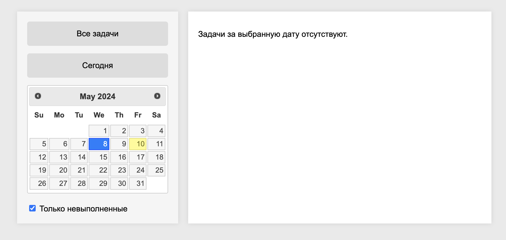

Описание

Создано приложение для управления задачами, выполненное на основе архитектуры "клиент-сервер". Серверная часть написана на Java, а клиентская — на HTML и JavaScript с использованием jQuery. Основное назначение приложения — управление списком задач посредством REST API.
Состав приложения:

    База данных:
        Используется внутренняя коллекция List, эмулирующая базу данных на время разработки.
    Серверная часть:
        Серверная часть написана с использованием фреймоворка Spring, Java
    Клиентская часть:
        HTML + JavaScript: Веб-интерфейс на HTML и JavaScript.

Инструкция по запуску:
- 1) Открываете Intellij IDEA
- 2) После чего выполняете команду `gradle build`
- 3) Запускаете Spring Boot приложение
- 4) Переходите в папку src/main/resources/front и открываете в браузере index.html
- 5) Наслаждаетесь

### Видео
[Ссылка на гугл диск](https://drive.google.com/file/d/1u3cqKX9HY14mkN2LJTWNhPtMMjZ1ctzT/view?usp=sharing)

Итог:

